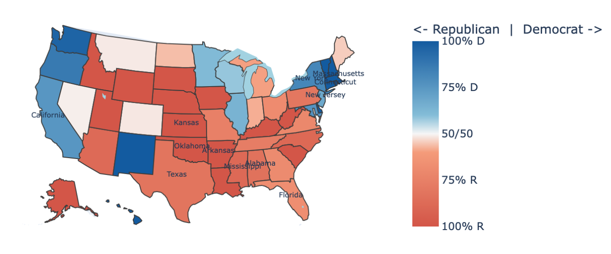

<div align="center">



# 🏛️ Congressional Twitter Intelligence

> A decade of congressional tweets analyzed to build a data-driven lobbying targeting system.

[](https://python.org)
[](https://sqlite.org)
[](https://jupyter.org)
[](https://scikit-learn.org)
[](LICENSE)

**1,243,370 tweets · 548 members · 2008–2017**

</div>

---

## 📊 Figures

| | |
|:---:|:---:|
| <br><sub>Fig 1 — Top 20 Democrat Bigrams</sub> | <br><sub>Fig 2 — Top 20 Republican Bigrams</sub> |
| <br><sub>Fig 3 — Top 15 Bipartisan Bigrams</sub> | <br><sub>Fig 4 — Vocabulary Divergence Over Time</sub> |
| <br><sub>Fig 5 — Retweet Distribution: Senate vs House</sub> | <br><sub>Fig 6 — Sentiment vs Log Retweet Count</sub> |
| <br><sub>Fig 7 — OLS Regression Coefficients</sub> | <br><sub>Fig 8 — Top 20 Members by LLS</sub> |

<div align="center">
  <br>
  <sub>Fig 9 — Bipartisan Window Score Heatmap by State × Month</sub>
</div>

---

## 🗂️ Project Overview

This capstone project analyzes a decade of congressional Twitter activity to build a data-driven lobbying targeting system. Twitter stores no political metadata — party, chamber, and state are all missing. We solved this through a three-step enrichment join against the `@unitedstates` legislators database, recovering metadata for **74.8%** of members.

---

## 🚀 Quickstart

> **Note:** The raw dataset is not included due to GitHub's file size limit. See [Data](#-data) below.

```bash
git clone https://github.com/username/congressional-twitter-intelligence.git
cd congressional-twitter-intelligence
pip install -r requirements.txt
jupyter notebook notebooks/milestone_3.ipynb
```

---

## 🛠️ Stack

| Tool | Purpose |
|---|---|
| SQLite | Primary database and storage |
| Python / pandas | Data wrangling and analysis |
| scikit-learn | TF-IDF vectorization, OLS regression |
| TextBlob | Sentiment scoring |
| matplotlib | Data visualization |
| scipy | Pearson correlation tests |

---

## 📁 Structure

```
repo/
├── figures/                  # All saved charts & plots (Fig 1–9)
├── data/                     # Place raw dataset here (see below)
├── notebooks/
│   ├── milestone_1.ipynb     # Data enrichment & setup
│   ├── milestone_2.ipynb     # Descriptive statistics
│   └── milestone_3.ipynb     # TF-IDF, regression, custom metrics
├── requirements.txt
└── README.md
```

---

## 💾 Data

The raw dataset (`US_PoliticalTweets.tar.gz`, 229MB) is not included in this repo due to GitHub's file size limit.

Download it from: [link to original source or Google Drive]

Once downloaded, place it in the `data/` folder and run `notebooks/milestone_3.ipynb` from the top.


## ⚠️ Caveats

- Dataset covers **2008–2017** only — Twitter's 280-char limit, follower growth, and political intensity all postdate the archive
- 24.4% of tweets could not be matched to a party (Independent members, data gaps)
- Sentiment scored via TextBlob on a 20K random sample — not full corpus
- LLS and BWS scores should be re-validated with updated data before operational use